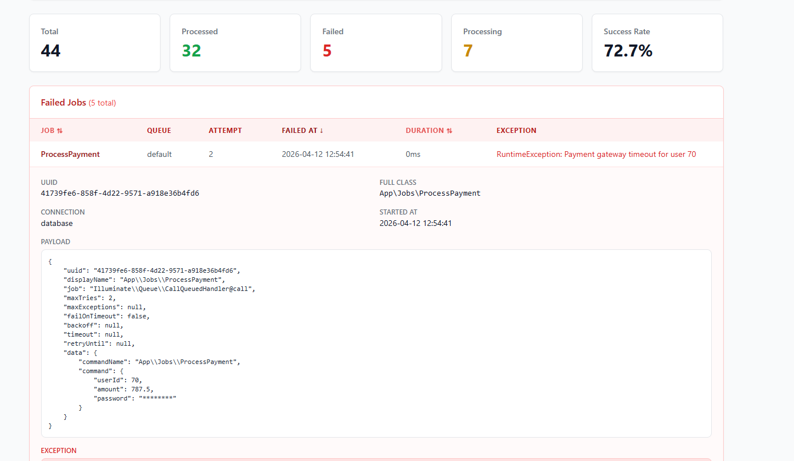

# yammi-jobs-monitoring-laravel

[](https://packagist.org/packages/romalytar/yammi-jobs-monitoring-laravel)
[](https://packagist.org/packages/romalytar/yammi-jobs-monitoring-laravel)
[](https://packagist.org/packages/romalytar/yammi-jobs-monitoring-laravel)
[](https://packagist.org/packages/romalytar/yammi-jobs-monitoring-laravel)

**Alternative to Horizon without Redis.** Lightweight queue monitoring for Laravel that works with any driver — Redis, Database, SQS, Sync. Tracks every job lifecycle (processing, success, failed), retries and execution time. Blade dashboard + JSON API included.

**Works out of the box. No Redis. No Horizon. No extra setup.**


## Why not Horizon?

| | Horizon | yammi-jobs-monitoring |
|---|---|---|
| Redis required | Yes | No |
| SQS / Database / Sync | No | Yes |
| Setup complexity | Supervisors, config, Redis | `composer require` + `migrate` |
| Weight | Full metrics platform | Lightweight monitor |

If you're on Redis and need supervisor management, throughput charts and process balancing — use Horizon. If you just want to know **"did my jobs run, which failed, and why"** across any driver — this package is for you.

## Quick Start

```bash
composer require romalytar/yammi-jobs-monitoring-laravel
php artisan migrate
```

Done. Visit `/jobs-monitor` to see the dashboard.

> Config publish is optional: `php artisan vendor:publish --tag=jobs-monitor-config`

## Requirements

- PHP `^8.1`
- Laravel `^9.0 || ^10.0 || ^11.0 || ^12.0`
- Any database supported by Laravel (MySQL, PostgreSQL, SQLite, etc.)

## What You Get



- **5 status cards** — Total, Processed, Failed, Processing, Success Rate
- **Failed Jobs table** — separate block, own pagination (10/page), own sorting
- **All Jobs table** — all records, pagination (50/page), own sorting
- **Accordion details** — click any row to expand: UUID, payload, exception
- **Period filter** — `1m`, `5m`, `30m`, `1h`, `6h`, `24h`, `7d`, `30d`, `all`
- **Search** — filter by job class name
- **Sorting** — by Status, Job name, Started At, Duration (columns with arrows)
- **Payload** — optionally stored, sensitive data auto-redacted

## Configuration

```php
// config/jobs-monitor.php
return [
    'enabled' => env('JOBS_MONITOR_ENABLED', true),

    // Store job payload. Sensitive keys (password, token, secret,
    // api_key, authorization, credit_card, cvv, ssn) are
    // automatically replaced with ********
    'store_payload' => env('JOBS_MONITOR_STORE_PAYLOAD', false),

    'ui' => [
        'enabled'    => env('JOBS_MONITOR_UI_ENABLED', true),
        'path'       => env('JOBS_MONITOR_UI_PATH', 'jobs-monitor'),
        'middleware'  => ['web'],
    ],

    'api' => [
        'enabled'    => env('JOBS_MONITOR_API_ENABLED', false),
        'path'       => env('JOBS_MONITOR_API_PATH', 'api/jobs-monitor'),
        'middleware'  => ['api'],
    ],
];
```

### Protect the dashboard

```php
'ui' => [
    'middleware' => ['web', 'auth', 'can:viewJobsMonitor'],
],
```

### Customize views

```bash
php artisan vendor:publish --tag=jobs-monitor-views
```

## JSON API

Enable in config, then use from any frontend:

```php
'api' => ['enabled' => true, 'middleware' => ['api', 'auth:sanctum']],
```

### Endpoints

| Endpoint | Description |
|---|---|
| `GET /api/jobs-monitor/jobs` | All jobs (paginated) |
| `GET /api/jobs-monitor/failures` | Failed jobs only (paginated) |
| `GET /api/jobs-monitor/stats?job_class=...` | Aggregate stats per class |

### Query Parameters

| Parameter | Description | Default |
|---|---|---|
| `period` | `1m`, `5m`, `30m`, `1h`, `6h`, `24h`, `7d`, `30d`, `all` | `24h` |
| `search` | Filter by job class (substring) | — |
| `sort` | `started_at`, `status`, `duration_ms`, `job_class` | `started_at` |
| `dir` | `asc`, `desc` | `desc` |
| `page` | Page number | `1` |
| `per_page` | Records per page (max 200) | `50` / `10` |

### Response

```json
{
    "data": [
        {
            "uuid": "550e8400-...",
            "attempt": 1,
            "job_class": "App\\Jobs\\SendInvoice",
            "connection": "redis",
            "queue": "default",
            "status": "processed",
            "started_at": "2026-04-12T12:00:00+00:00",
            "finished_at": "2026-04-12T12:00:02+00:00",
            "duration_ms": 2000,
            "exception": null,
            "payload": { "..." }
        }
    ],
    "meta": { "total": 400, "page": 1, "per_page": 50, "last_page": 8 }
}
```

## Payload & Security

When `store_payload` is enabled:

1. PHP serialized command data is **deserialized** into readable key-value pairs
2. Keys containing `password`, `token`, `secret`, `api_key`, `authorization`, `credit_card`, `cvv`, `ssn` are **replaced with `********`**
3. Redaction works **recursively** at any depth, on any payload structure

When disabled (default) — no payload is stored.

## Facade

```php
use Yammi\JobsMonitor\Infrastructure\Facade\JobsMonitor;

JobsMonitor::recentJobs(50);
JobsMonitor::recentFailures(24);
JobsMonitor::stats(App\Jobs\SendInvoice::class);
JobsMonitor::queueSize('default');
```

## License

MIT
