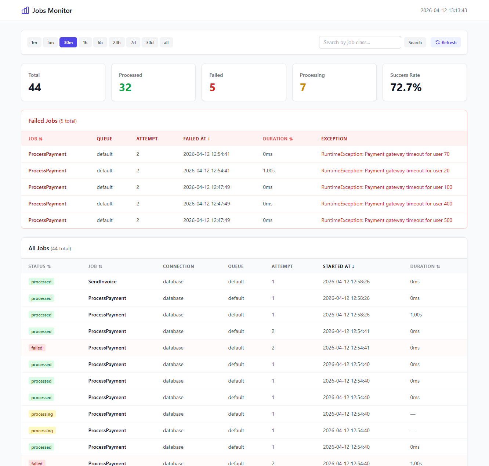
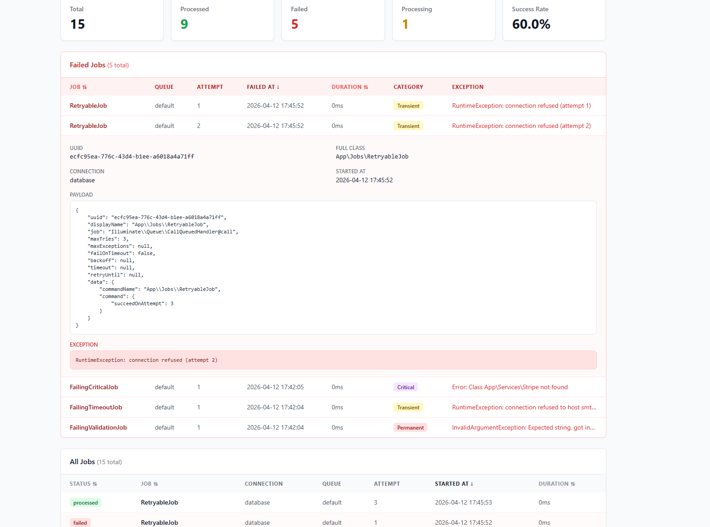
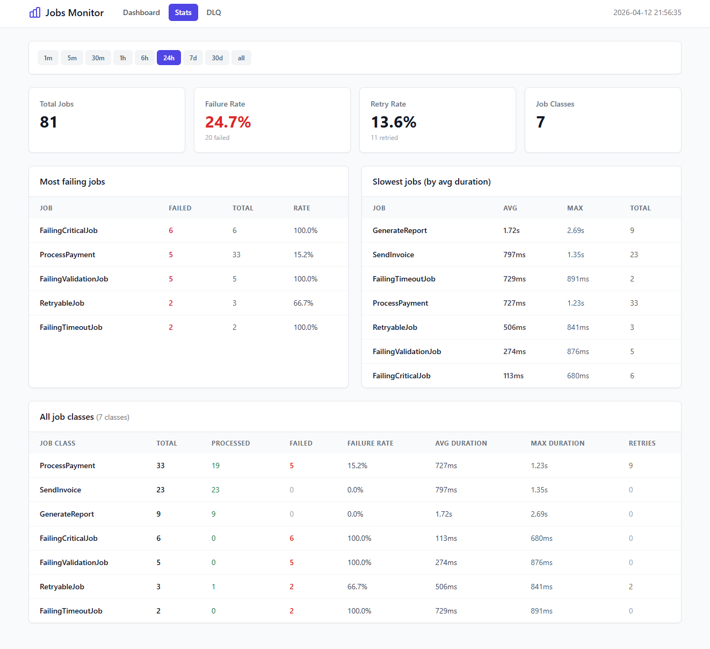
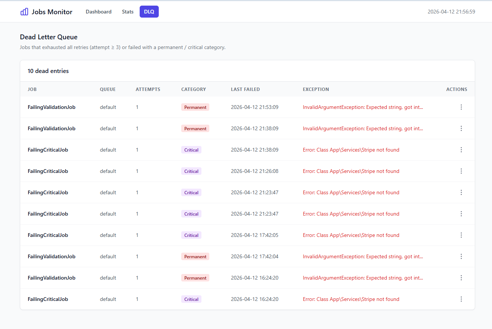
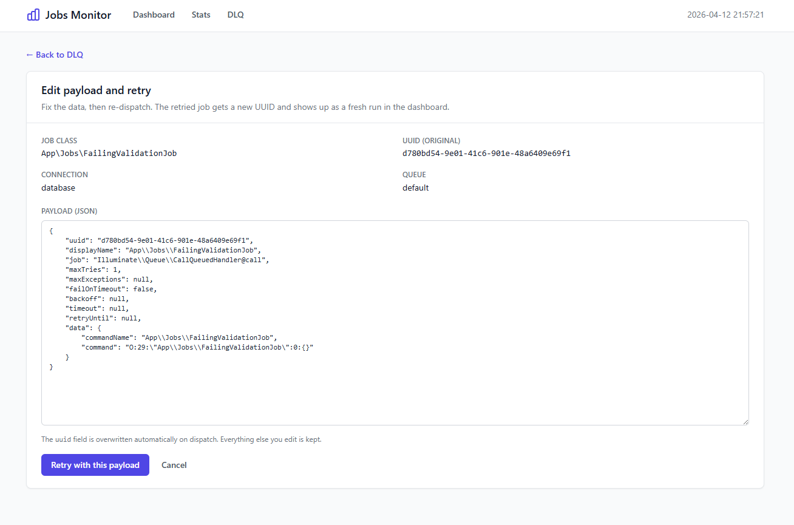

# yammi-jobs-monitoring-laravel

[](https://packagist.org/packages/romalytar/yammi-jobs-monitoring-laravel)
[](https://packagist.org/packages/romalytar/yammi-jobs-monitoring-laravel)
[](https://packagist.org/packages/romalytar/yammi-jobs-monitoring-laravel)
[](https://packagist.org/packages/romalytar/yammi-jobs-monitoring-laravel)

A simple queue monitoring tool for Laravel.

It logs every job and shows:
- what ran
- what failed
- why it failed
- how long it took

Works with any queue driver.



## Why this exists

Debugging Laravel queues in production is painful.

You don't see:
- what actually ran
- why it failed
- how many times it retried

I built this because I kept running into that problem and wanted
something simple that just shows what's happening, without heavy setup.

## Install

```bash
composer require romalytar/yammi-jobs-monitoring-laravel
php artisan migrate
```

Install, open `/jobs-monitor`, and you immediately see what's
happening. Config is optional — defaults are sensible.

## Requirements

- PHP `^8.1`
- Laravel `^9.0 || ^10.0 || ^11.0 || ^12.0 || ^13.0`
- Any database supported by Laravel

## What's in it

### Dashboard

Every job that runs shows up here. Period pills, search by job class,
filters for status / queue / connection / failure category. Active
filters become chips you can remove one at a time.


### Retry timeline

Click any job to see its full history. If it was retried, you see
every attempt — status, failure tag, duration, exception — and you
can jump between attempts with one click.



### Stats

One page to answer "how are my jobs doing": total, failure rate, retry
rate, most failing, slowest, plus a per-class breakdown.



### Dead letter queue

Jobs that ran out of retries or hit a permanent/critical failure land
here. Each row has a menu:

- **Retry** — re-dispatches with a fresh UUID so the new run shows
  up cleanly
- **Edit & retry** — opens a JSON editor; fix the data, submit, back
  on the queue
- **Delete** — removes every stored attempt for that UUID





### Failure tagging

When a job fails we look at the exception and tag it:

| Category    | Meaning                                  | Examples                                      |
|-------------|------------------------------------------|-----------------------------------------------|
| `transient` | Retry likely helps                       | timeout, deadlock, connection refused, 429    |
| `permanent` | Retry won't help, data/code is wrong     | validation, type error, invalid argument      |
| `critical`  | Code is broken, human attention needed   | class not found, undefined method, parse error |
| `unknown`   | No pattern matched                       | anything else                                  |

You know your own exceptions better than the package does, so you can
swap in your own classifier:

```php
// config/jobs-monitor.php
'failure_classifier' => \App\Monitoring\MyClassifier::class,
```

Any class that implements
`Yammi\JobsMonitor\Domain\Job\Contract\FailureClassifier` works.

### Retention

The table grows forever if you don't clean it up. There's a command:

```bash
php artisan jobs-monitor:prune --days=30
```

Plug it into your scheduler:

```php
$schedule->command('jobs-monitor:prune')->daily();
```

### Alerts

The monitor can stop being passive. Turn alerts on and it pings Slack
or email the moment things go wrong — no more refreshing the dashboard.

Minimum setup:

```dotenv
JOBS_MONITOR_ALERTS_ENABLED=true
JOBS_MONITOR_SLACK_WEBHOOK=https://hooks.slack.com/services/T.../B.../...
JOBS_MONITOR_ALERT_MAIL_TO=ops@acme.com,oncall@acme.com
```

Make sure a queue worker is running — alert delivery is queued so it
never blocks the job that just failed. The package registers a
scheduled job that evaluates rules every minute.

#### What ships built-in

Two rules come enabled by default:

| Id                  | When it fires                                       | Cooldown |
|---------------------|-----------------------------------------------------|----------|
| `critical_failure`  | Any job tagged `critical` in the last 5 minutes     | 10 min   |
| `retry_storm`       | 5+ failures at attempt ≥ 2 in the last 10 minutes   | 15 min   |

Two more ship disabled — enable after you know your baseline:

| Id                  | Condition                                    |
|---------------------|----------------------------------------------|
| `high_failure_rate` | 20+ failures in the last 5 minutes            |
| `dlq_growing`       | DLQ size ≥ 10                                 |

Tweak any default in `config/jobs-monitor.php`:

```php
'alerts' => [
    'built_in' => [
        'critical_failure' => [
            'channels' => ['slack'],   // only slack, skip email
            'threshold' => 3,          // require 3 critical failures, not 1
        ],
        'dlq_growing' => [
            'enabled' => true,         // turn it on
            'threshold' => 50,
        ],
    ],
    'custom_rules' => [
        // Add your own:
        [
            'trigger' => 'job_class_failure_rate',
            'value' => 'App\\Jobs\\SendInvoice',
            'window' => '30m',
            'threshold' => 3,
            'channels' => ['slack'],
            'cooldown_minutes' => 30,
        ],
    ],
],
```

#### Triggers you can use in custom rules

- `failure_rate` — aggregate failures across all jobs in a window
- `failure_category` — specific category (`transient`, `permanent`, `critical`, `unknown`)
- `job_class_failure_rate` — failures for a named job class
- `dlq_size` — absolute size of the dead-letter queue (no window)

All but `dlq_size` accept an optional `min_attempt`: "only count
failures at attempt ≥ N". Useful for silencing first-try noise.

#### Anti-spam by design

Three guarantees stack so 50 job failures never become 50 messages:

1. **Thresholds aggregate** — a rule fires once when the count crosses N,
   not once per failure.
2. **Per-rule cooldown** — after firing, the rule goes quiet for
   `cooldown_minutes`. Runs in the cache store; concurrent evaluators
   race safely via `Cache::add()`.
3. **Scheduled evaluation** — the orchestrator runs at most once per
   minute, not on every job event.

Worst case with four rules at 15-minute cooldowns = 16 messages/hour
during a sustained outage. Typical case = one message per incident.

#### Previewing without real Slack or SMTP

No Slack workspace? Use [webhook.site](https://webhook.site) — it gives
you a catch-all URL. Paste it as `JOBS_MONITOR_SLACK_WEBHOOK` and every
alert shows up on the page with full headers and body, including the
HMAC signature. Copy the JSON into
[Slack's Block Kit Builder](https://app.slack.com/block-kit-builder)
to see how Slack would render it.

No SMTP set up? Switch Laravel's mailer to the log driver:

```dotenv
MAIL_MAILER=log
```

Every alert ends up fully rendered in `storage/logs/laravel.log`.

## Configuration

```php
// config/jobs-monitor.php
return [
    'enabled' => env('JOBS_MONITOR_ENABLED', true),

    // Store raw job payload. Sensitive keys (password, token, secret,
    // api_key, authorization, credit_card, cvv, ssn) are automatically
    // replaced with ********. Required for DLQ retry to work.
    'store_payload' => env('JOBS_MONITOR_STORE_PAYLOAD', false),

    'failure_classifier' => null,          // FQCN or null for default

    'retention_days' => env('JOBS_MONITOR_RETENTION_DAYS', 30),

    'max_tries' => env('JOBS_MONITOR_MAX_TRIES', 3),

    'dlq' => [
        // Gate ability to consult before retry/delete.
        // Null = no check (fine for single-user setups, not for prod).
        'authorization' => env('JOBS_MONITOR_DLQ_GATE'),
    ],

    'ui' => [
        'enabled'    => env('JOBS_MONITOR_UI_ENABLED', true),
        'path'       => env('JOBS_MONITOR_UI_PATH', 'jobs-monitor'),
        'middleware' => ['web'],
    ],

    'api' => [
        'enabled'    => env('JOBS_MONITOR_API_ENABLED', false),
        'path'       => env('JOBS_MONITOR_API_PATH', 'api/jobs-monitor'),
        'middleware' => ['api'],
    ],
];
```

### Protecting the dashboard

```php
'ui' => [
    'middleware' => ['web', 'auth', 'can:viewJobsMonitor'],
],
```

### Authorizing destructive DLQ actions

```php
// AppServiceProvider or AuthServiceProvider
Gate::define('manage-jobs-monitor', function ($user, string $action) {
    // $action is 'retry' or 'delete'
    return $user->hasRole('admin');
});
```

```dotenv
JOBS_MONITOR_DLQ_GATE=manage-jobs-monitor
```

### Publishing views / config / migrations

```bash
php artisan vendor:publish --tag=jobs-monitor-config
php artisan vendor:publish --tag=jobs-monitor-views
php artisan vendor:publish --tag=jobs-monitor-migrations
```

## JSON API

Everything in the UI is also available as JSON. Turn it on in config:

```php
'api' => ['enabled' => true, 'middleware' => ['api', 'auth:sanctum']],
```

| Endpoint                                           | Purpose                                |
|----------------------------------------------------|----------------------------------------|
| `GET  /api/jobs-monitor/jobs`                      | Paginated jobs with filters & sorting  |
| `GET  /api/jobs-monitor/jobs/{uuid}/attempts`      | Every attempt for a UUID               |
| `GET  /api/jobs-monitor/failures`                  | Failed jobs only                       |
| `GET  /api/jobs-monitor/stats?job_class=...`       | Stats for one class                    |
| `GET  /api/jobs-monitor/stats/overview`            | Per-class stats across all classes     |
| `GET  /api/jobs-monitor/dlq`                       | Dead-letter entries                    |
| `POST /api/jobs-monitor/dlq/{uuid}/retry`          | Re-dispatch (optionally with edited payload) |
| `POST /api/jobs-monitor/dlq/{uuid}/delete`         | Remove every stored attempt            |

Filters on `/jobs` and `/failures`:

| Query param        | Values                                                   |
|--------------------|----------------------------------------------------------|
| `period`           | `1m` `5m` `30m` `1h` `6h` `24h` `7d` `30d` `all`         |
| `search`           | Substring on `job_class` (case-insensitive)              |
| `status`           | `processing` `processed` `failed`                        |
| `queue`            | Exact match                                              |
| `connection`       | Exact match                                              |
| `failure_category` | `transient` `permanent` `critical` `unknown`             |
| `sort`             | `started_at` `status` `duration_ms` `job_class`          |
| `dir`              | `asc` `desc`                                             |
| `page`, `per_page` | 1-based page, up to 200 per page                         |

Each record in the response includes the failure category:

```json
{
  "uuid": "550e8400-...",
  "attempt": 1,
  "job_class": "App\\Jobs\\SendInvoice",
  "connection": "redis",
  "queue": "default",
  "status": "failed",
  "started_at": "2026-04-12T12:00:00+00:00",
  "finished_at": "2026-04-12T12:00:02+00:00",
  "duration_ms": 2000,
  "exception": "RuntimeException: connection refused",
  "failure_category": "transient",
  "payload": { "..." }
}
```

There's a ready-to-use Postman collection under `postman/` with
example requests for every filter, sort column, retry, edit-and-retry
and delete.

## Payload & security

When `store_payload` is on, the serialized command gets decoded into
readable key-value pairs and keys like `password`, `token`, `secret`,
`api_key`, `authorization`, `credit_card`, `cvv`, `ssn` get replaced
with `********`. It works recursively at any depth.

When it's off (the default) no payload is stored, and DLQ retry is
refused — there's nothing to re-dispatch.

One thing worth saying: if the monitor itself fails for some reason,
your job still runs. The monitor's job is to watch, not to get in
the way.

## Facade

```php
use Yammi\JobsMonitor\Infrastructure\Facade\JobsMonitor;

JobsMonitor::recentJobs(50);
JobsMonitor::recentFailures(24);
JobsMonitor::stats(App\Jobs\SendInvoice::class);
JobsMonitor::queueSize('default');
```

## License

MIT
