# yammi-jobs-monitoring-laravel

[](https://packagist.org/packages/romalytar/yammi-jobs-monitoring-laravel)
[](https://packagist.org/packages/romalytar/yammi-jobs-monitoring-laravel)
[](https://packagist.org/packages/romalytar/yammi-jobs-monitoring-laravel)
[](https://packagist.org/packages/romalytar/yammi-jobs-monitoring-laravel)

A monitoring layer for Laravel queues that shows what actually happens during execution — retries, failures, anomalies, worker health, and alerts.
Works with any queue driver — Redis, SQS, database, or sync.

| Dark | Light |
|------|-------|
| 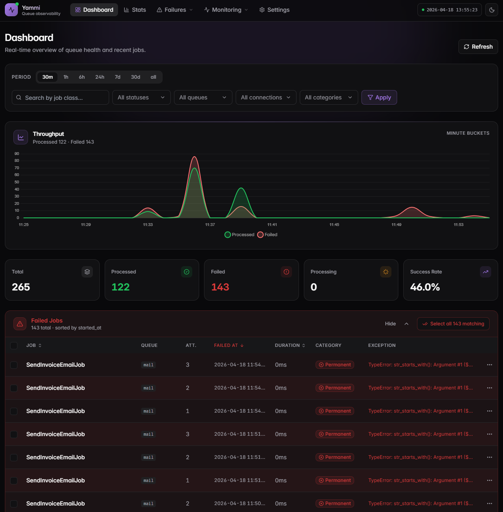 |  |

## Install

```bash
composer require romalytar/yammi-jobs-monitoring-laravel
php artisan migrate
```

Open `/jobs-monitor`. Config is optional — defaults are sensible.

## Requirements

- PHP `^8.1`
- Laravel `^9.0 || ^10.0 || ^11.0 || ^12.0 || ^13.0`
- Any database supported by Laravel

## Features

- [Live dashboard](#dashboard) — cards, chart, filters, dark/light theme
- [Stats](#stats) — per-class failure rate, retry rate, slowest jobs
- [Dead letter queue (DLQ)](#dead-letter-queue-dlq) — retry, edit & retry, bulk ops
- [Failure fingerprinting](#failure-fingerprinting) — groups recurring failures into clear, trackable error patterns.
- [Scheduled task monitoring](#scheduled-task-monitoring) — silent failure detection, outcome reports
- [Worker heartbeat](#worker-heartbeat) — live worker state, silent-worker alerts
- [Anomaly detection](#anomaly-detection) — duration spikes and drops per job class
- [Proactive alerts](#proactive-alerts) — Slack, email, PagerDuty, Opsgenie, Webhook
- [General settings UI](#general-settings-ui) — tune the package without a redeploy
- [Facade Playground](#facade-playground) — programmatic access + interactive method browser
- [Retention](#retention) — automated pruning keeps the DB small

---

## Dashboard

Summary cards (total / processing / processed / failed / retry rate) and
a time-series chart that refresh automatically — no page reload needed.

Period pills, search by job class, and four dropdowns (**Status**, **Queue**,
**Connection**, **Failure category**) combine freely. Queue and connection
values are populated from real data; active filters appear as chips you
can dismiss one at a time or clear all at once.

Click any row to expand the full attempt timeline — every retry, its
status, exception, failure tag, and duration in one place.


---

## Stats

Top failing classes, slowest jobs, retry rate, and a per-class breakdown
on one page.

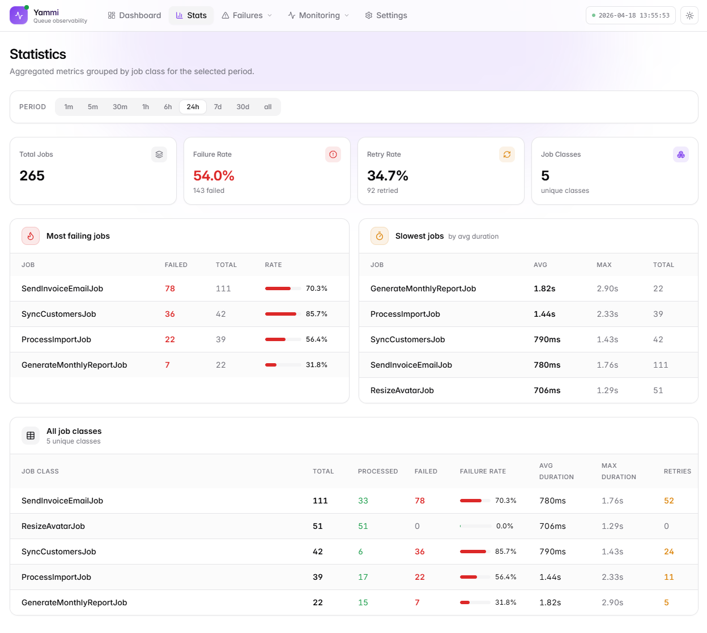

---

## Dead letter queue (DLQ)

Jobs that exhausted retries or hit a `permanent` / `critical` failure
land here. Each row has a three-dots menu:

- **Retry** — re-dispatches with a fresh UUID
- **Edit & retry** — opens a JSON editor; fix the payload, submit
- **Delete** — removes all stored attempts for the UUID

**Bulk operations:** select rows (or "select all N matching" across every
page), then retry or delete in one click. Requests are chunked
client-side so batches of thousands finish without timeouts.


### Failure tagging

| Category | Meaning | Examples |
|---|---|---|
| `transient` | Retry likely helps | timeout, deadlock, 429 |
| `permanent` | Retry won't help | validation, type error |
| `critical` | Code is broken | class not found, parse error |
| `unknown` | No pattern matched | anything else |

Bring your own classifier:

```php
// config/jobs-monitor.php
'failure_classifier' => \App\Monitoring\MyClassifier::class,
```

Any class implementing
`Yammi\JobsMonitor\Domain\Job\Contract\FailureClassifier` works.

---

## Failure fingerprinting

Exceptions are automatically grouped by a stable fingerprint (exception
class + normalized stack trace). Each group shows occurrence count,
affected job classes, first/last seen, and a sample stack trace.

Per-group actions from the same three-dots menu: retry all jobs in the
group, delete all, or inspect the sample trace. Alert rules can target
a fingerprint directly so you get notified when the same error recurs.

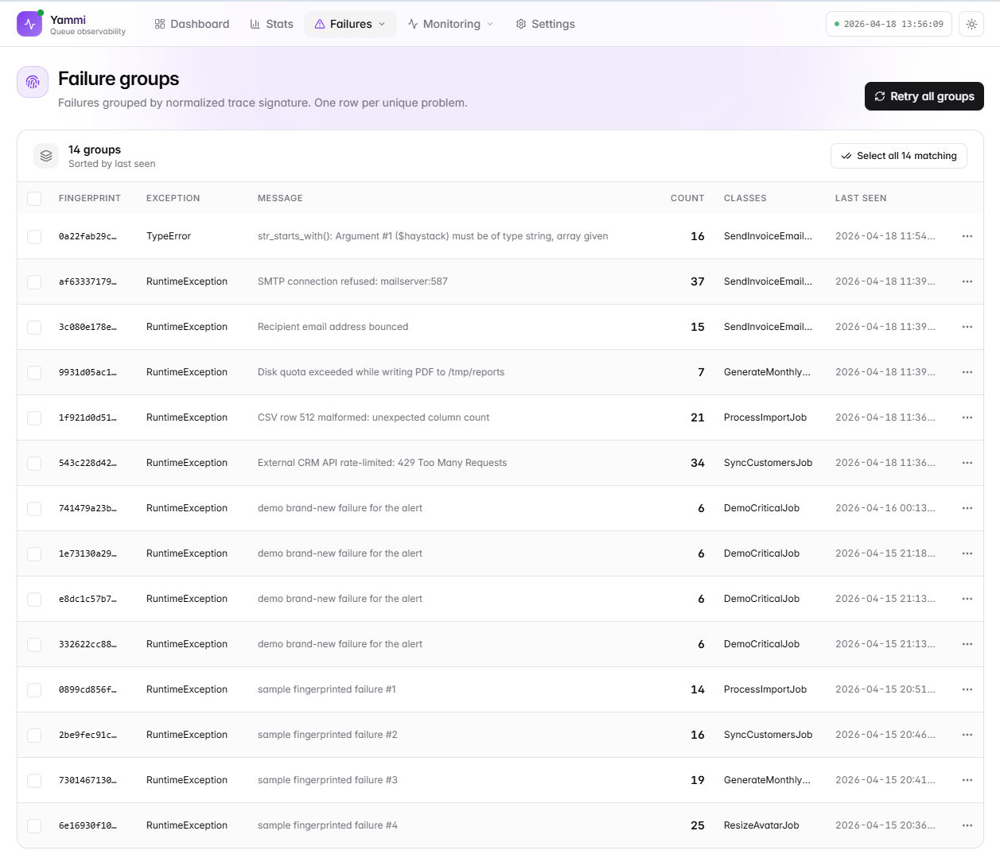

---

## Scheduled task monitoring

Every scheduled task is tracked — start time, outcome, duration, and any
output or exception. The package detects:

- **Silent failures** — task ran but produced no outcome marker
- **Missing runs** — task was expected but never fired
- **Long / short durations** — via anomaly detection (see below)

Outcome reports land in the Alerts channels so on-call knows which tasks
succeeded and which need attention.

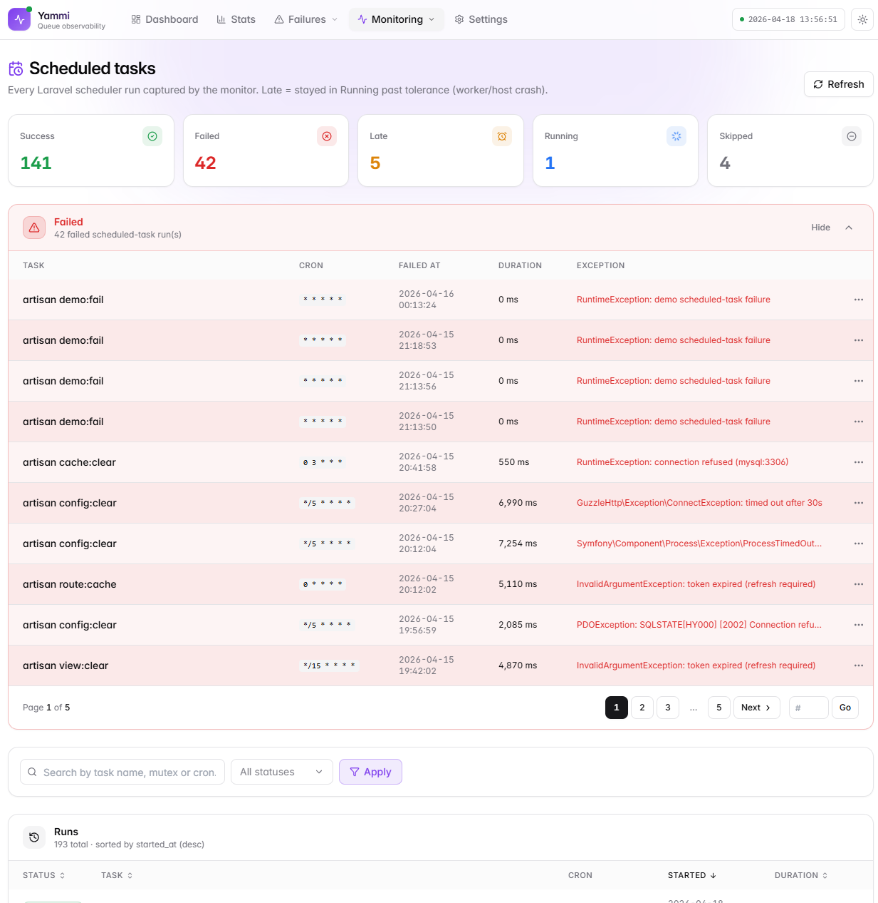

---

## Worker heartbeat

Workers send a heartbeat on each polling cycle. The dashboard shows:

- Which workers are alive, their queue, connection, and last-seen time
- Workers that went silent (configurable threshold)
- Under-provisioned queues (expected workers vs. alive)

A watchdog command (`jobs-monitor:worker-watchdog`) fires alerts when
workers disappear.

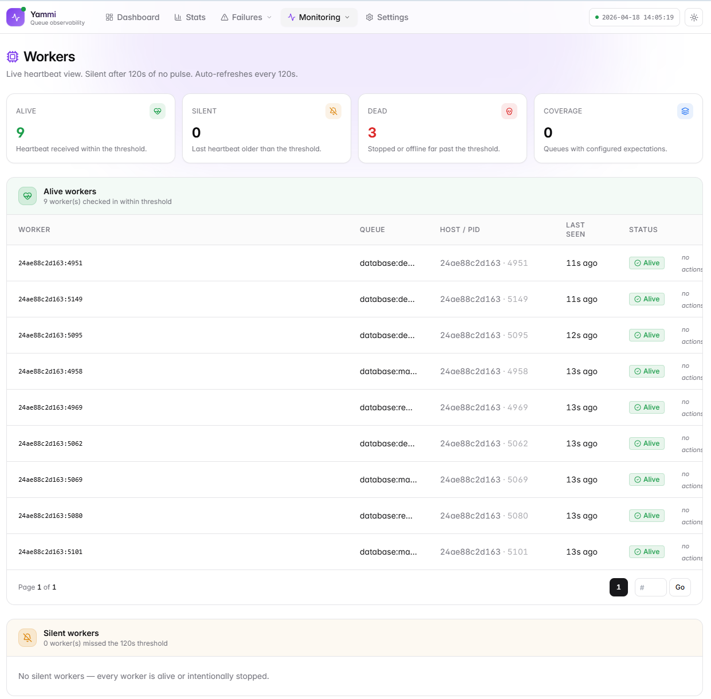

---

## Anomaly detection

Statistical baselines are built per job class from historical duration
data. When a job runs significantly shorter or longer than its baseline
the package flags it:

- **Duration spike** — job is taking much longer than normal
- **Duration drop** — job finished suspiciously fast (silent failure?)

Baselines refresh automatically on a configurable cron. Anomalies appear
in the dedicated UI page and trigger alerts.

| Anomalies overview | Detail |
|---|---|
| 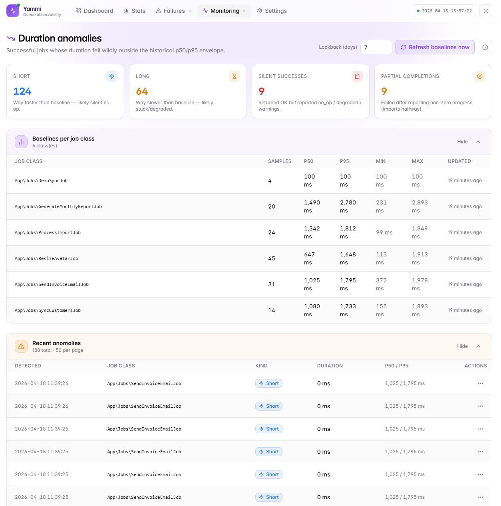 | 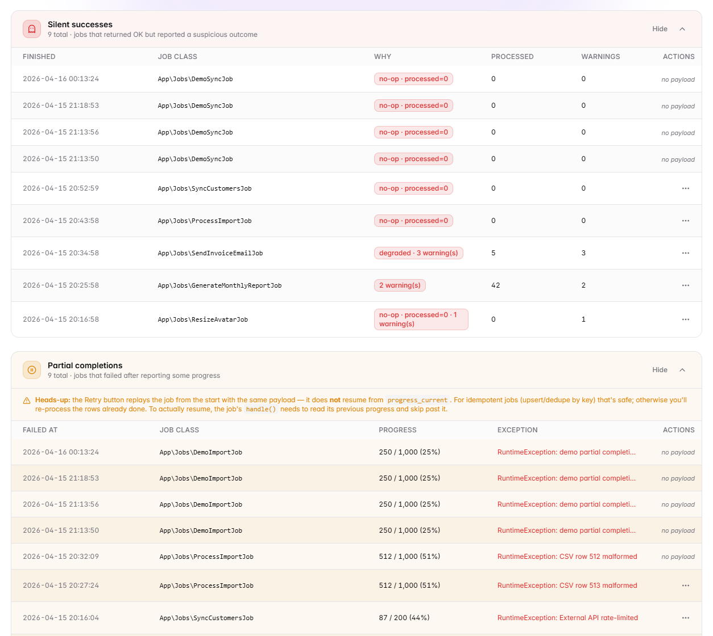 |

---

## Proactive alerts

Five delivery channels — **Slack**, **Email**, **PagerDuty**, **Opsgenie**,
**Webhook** — all fire together for every trigger. Alerts include deep
links back to the exact page and row that triggered them. Resolve
semantics: when the condition clears, a recovery message is sent
automatically.

Built-in triggers (four ship enabled by default):

| Trigger | What fires it |
|---|---|
| Failure rate | % failed jobs in a window exceeds threshold |
| Failure category | `permanent` / `critical` count exceeds threshold |
| DLQ size | Dead-letter count exceeds threshold |
| Worker silent | A worker hasn't heartbeated within tolerance |
| Scheduled silent | A scheduled task produced no outcome |
| Duration anomaly | Job duration deviates from baseline |

Minimum setup:

```dotenv
JOBS_MONITOR_ALERTS_ENABLED=true
JOBS_MONITOR_SLACK_WEBHOOK=https://hooks.slack.com/services/...
JOBS_MONITOR_ALERT_MAIL_TO=ops@acme.com
JOBS_MONITOR_PAGERDUTY_KEY=...
JOBS_MONITOR_OPSGENIE_KEY=...
JOBS_MONITOR_WEBHOOK_URL=https://your-endpoint.example.com/hook
JOBS_MONITOR_WEBHOOK_SECRET=...   # HMAC-SHA256 signature
```

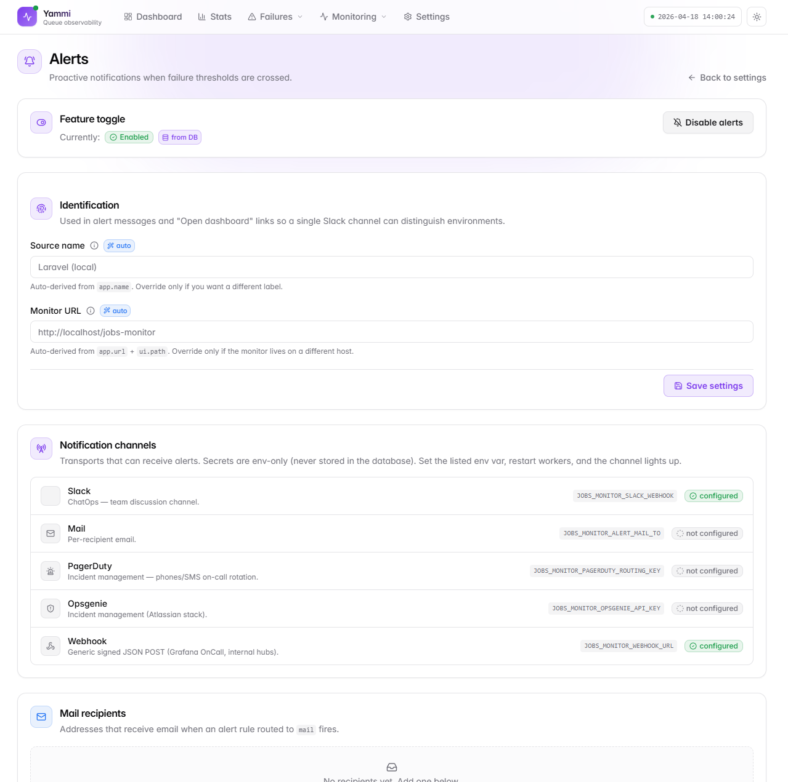

---

## General settings UI

Operational config lives in the database so operators can tune the
package without a redeploy. 23 settings across 7 groups:

| Group | Settings |
|---|---|
| General | store_payload, retention_days, max_tries |
| Bulk operations | max_ids_per_request, candidate_limit |
| Scheduler monitoring | enabled, watchdog, watchdog tolerance |
| Duration anomaly | enabled, min_samples, short/long factor |
| Outcome reports | enabled |
| Worker heartbeat | enabled, interval, silent threshold, retention, cron |
| Alerts schedule | enabled, cron, queue |

Resolution order: **DB row → config value → package default**. Each
setting shows its source badge. **Reset to defaults** clears all DB
overrides in one click.

Secrets and boot-time config (webhook URLs, API keys, middleware) stay
in `.env` / `config` forever.

| General settings | Database connection |
|---|---|
| 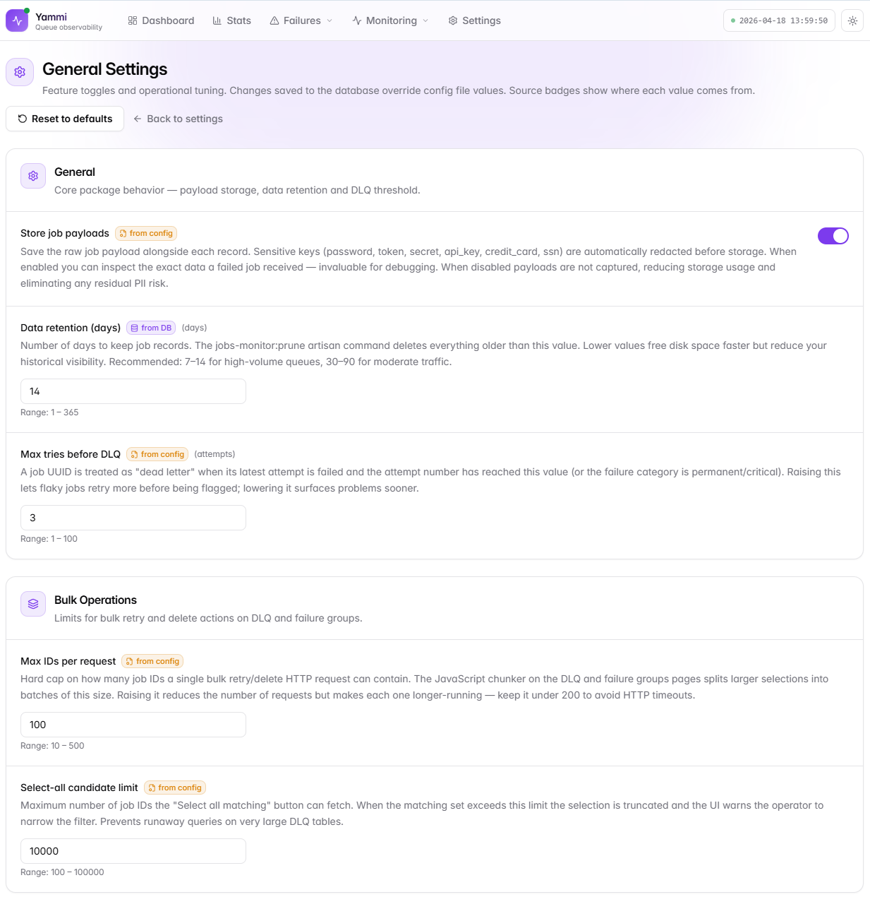 | 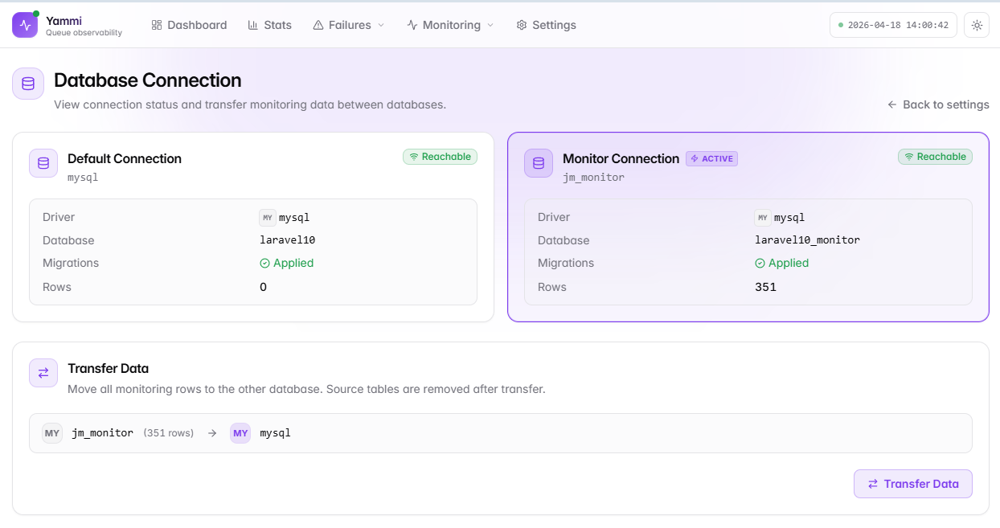 |

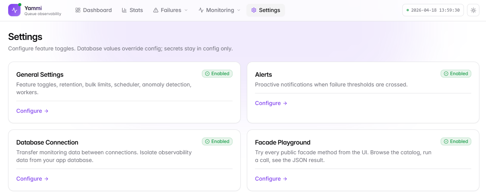

---

## Facade Playground

Three facades — `YammiJobs` (reads), `YammiJobsManage` (retries/deletes),
`YammiJobsSettings` (settings & rules) — let you drive the entire
dashboard programmatically. Every available method is browsable and
executable from `/jobs-monitor/settings/playground`: pick a method,
fill the auto-generated form, press **Run**, see the JSON result.

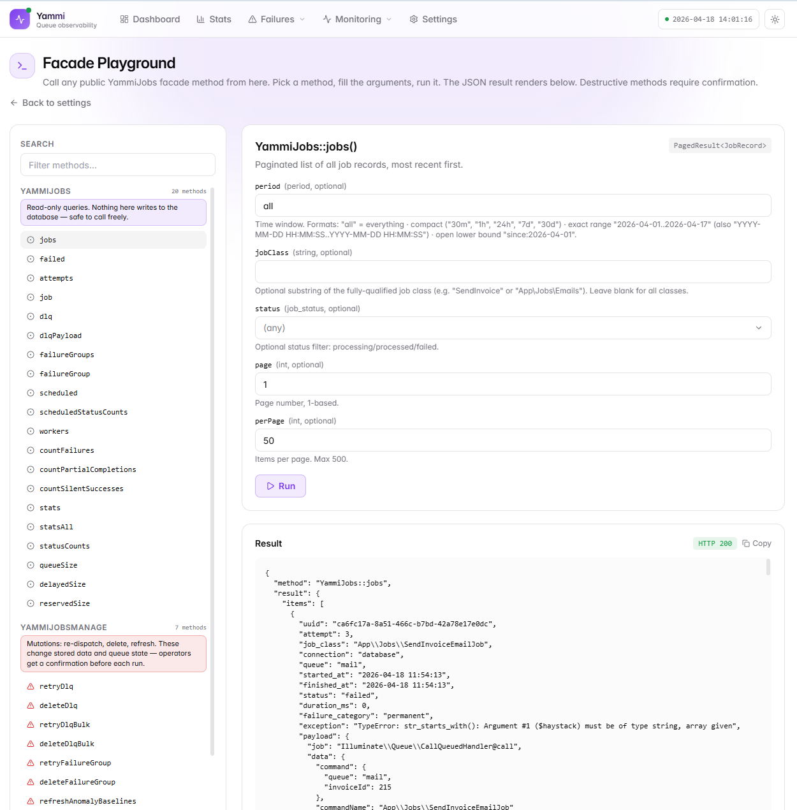

---

## Retention

```bash
php artisan jobs-monitor:prune --days=30
```

```php
$schedule->command('jobs-monitor:prune')->daily();
```

---

## Configuration

```php
// config/jobs-monitor.php
return [
    'enabled' => env('JOBS_MONITOR_ENABLED', true),

    // Store raw job payload (required for DLQ edit & retry).
    // Sensitive keys are auto-masked: password, token, secret, api_key,
    // authorization, credit_card, cvv, ssn.
    'store_payload' => env('JOBS_MONITOR_STORE_PAYLOAD', false),

    'failure_classifier' => null, // FQCN or null for built-in

    'retention_days' => env('JOBS_MONITOR_RETENTION_DAYS', 30),

    'max_tries' => env('JOBS_MONITOR_MAX_TRIES', 3),

    'dlq' => [
        // Gate ability consulted before retry / delete.
        'authorization' => env('JOBS_MONITOR_DLQ_GATE'),
    ],

    'ui' => [
        'enabled'    => env('JOBS_MONITOR_UI_ENABLED', true),
        'path'       => env('JOBS_MONITOR_UI_PATH', 'jobs-monitor'),
        'middleware' => ['web'],
    ],

    'alerts' => [
        'enabled' => env('JOBS_MONITOR_ALERTS_ENABLED', false),
    ],
];
```

### Protecting the dashboard

```php
'ui' => [
    'middleware' => ['web', 'auth', 'can:viewJobsMonitor'],
],
```

### Authorizing destructive DLQ actions

```php
// AppServiceProvider
Gate::define('manage-jobs-monitor', function ($user, string $action) {
    // $action is 'retry' or 'delete'
    return $user->hasRole('admin');
});
```

```dotenv
JOBS_MONITOR_DLQ_GATE=manage-jobs-monitor
```

### Publishing assets

```bash
php artisan vendor:publish --tag=jobs-monitor-config
php artisan vendor:publish --tag=jobs-monitor-views
php artisan vendor:publish --tag=jobs-monitor-migrations
```

---

## Security

- **No payload stored by default.** Enable `store_payload` explicitly.
- **Automatic sensitive-key masking.** Passwords, tokens, API keys,
  credit card numbers masked recursively at any depth. BYO redactor
  to extend the list.
- **Explicit Gate on destructive actions.** Retry and delete consult
  `JOBS_MONITOR_DLQ_GATE` before running.
- **UI behind middleware.** Mount behind `auth` or a Gate; anonymous
  access is blocked by default.
- **Fail-closed.** If the monitor can't write, it logs and skips — your
  job still runs.

---

## License

MIT
