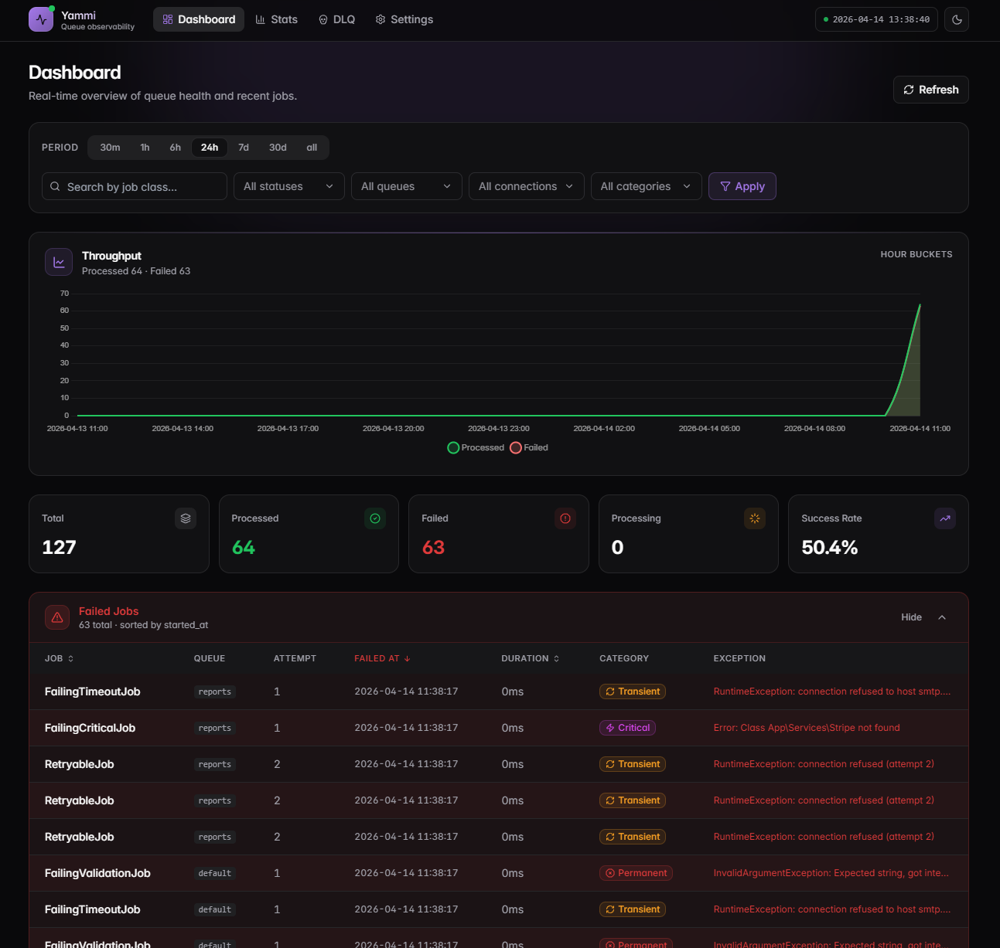
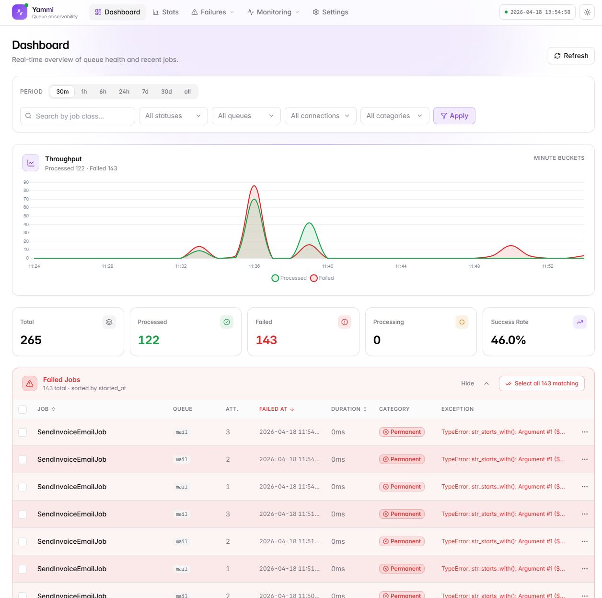
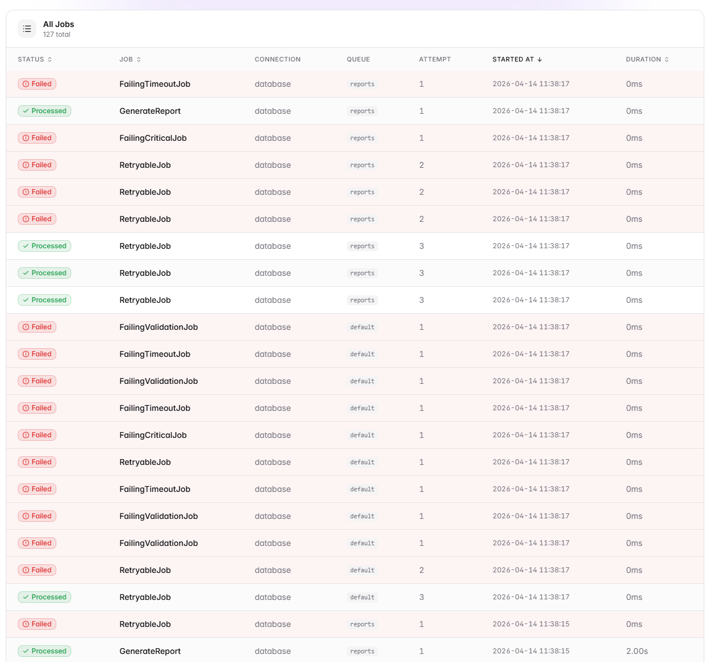
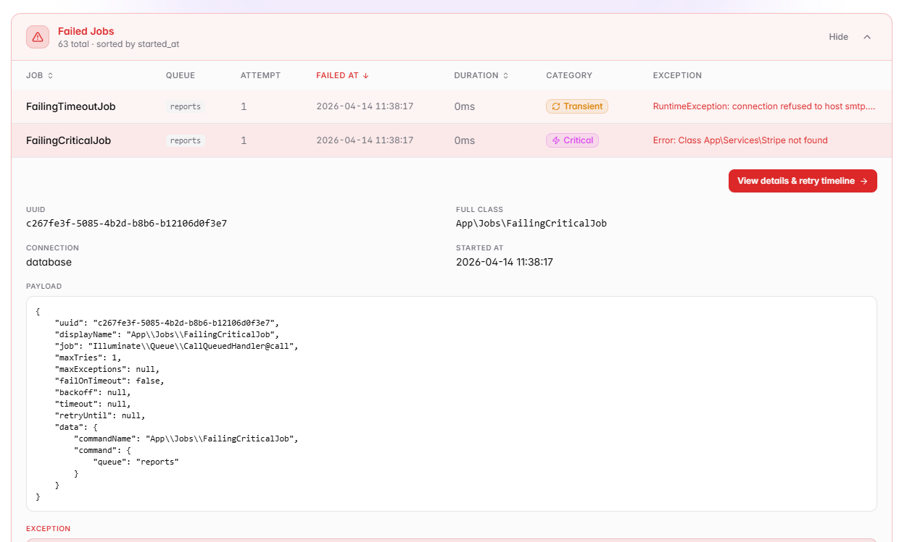
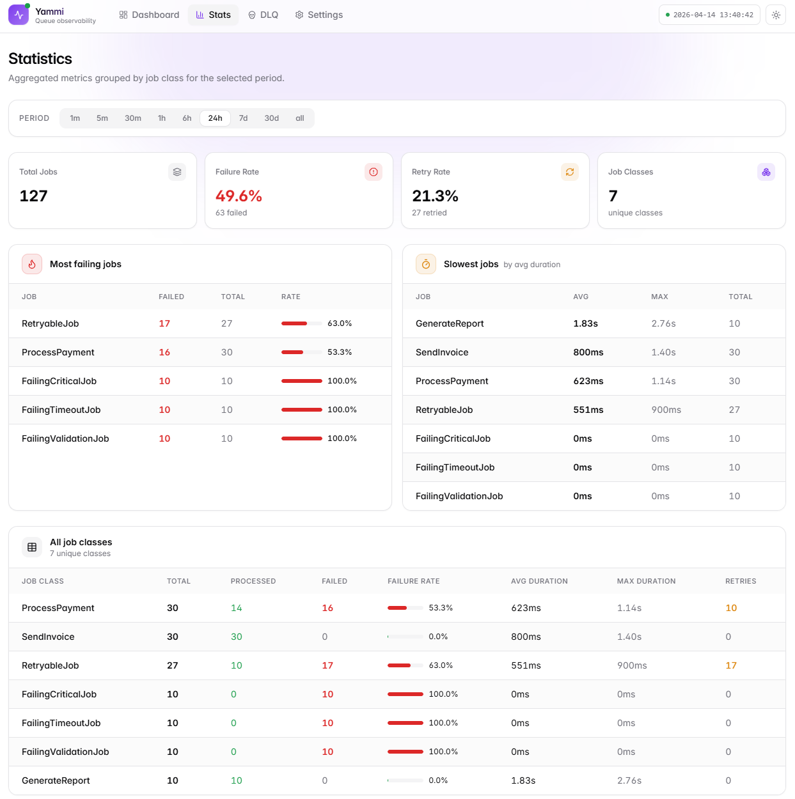
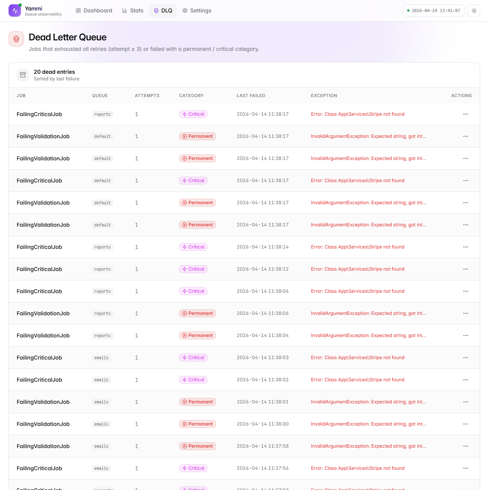
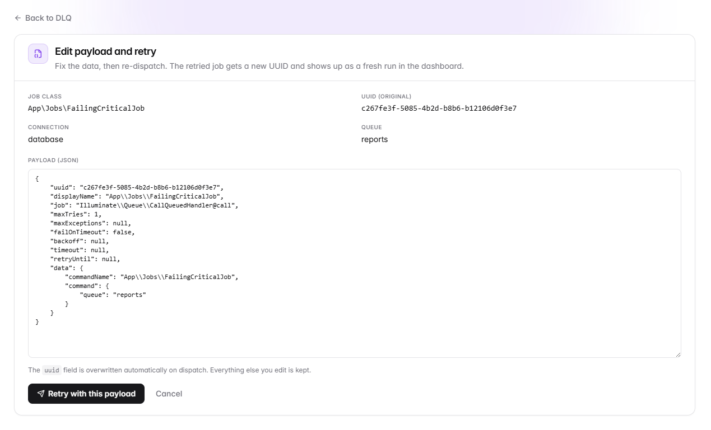
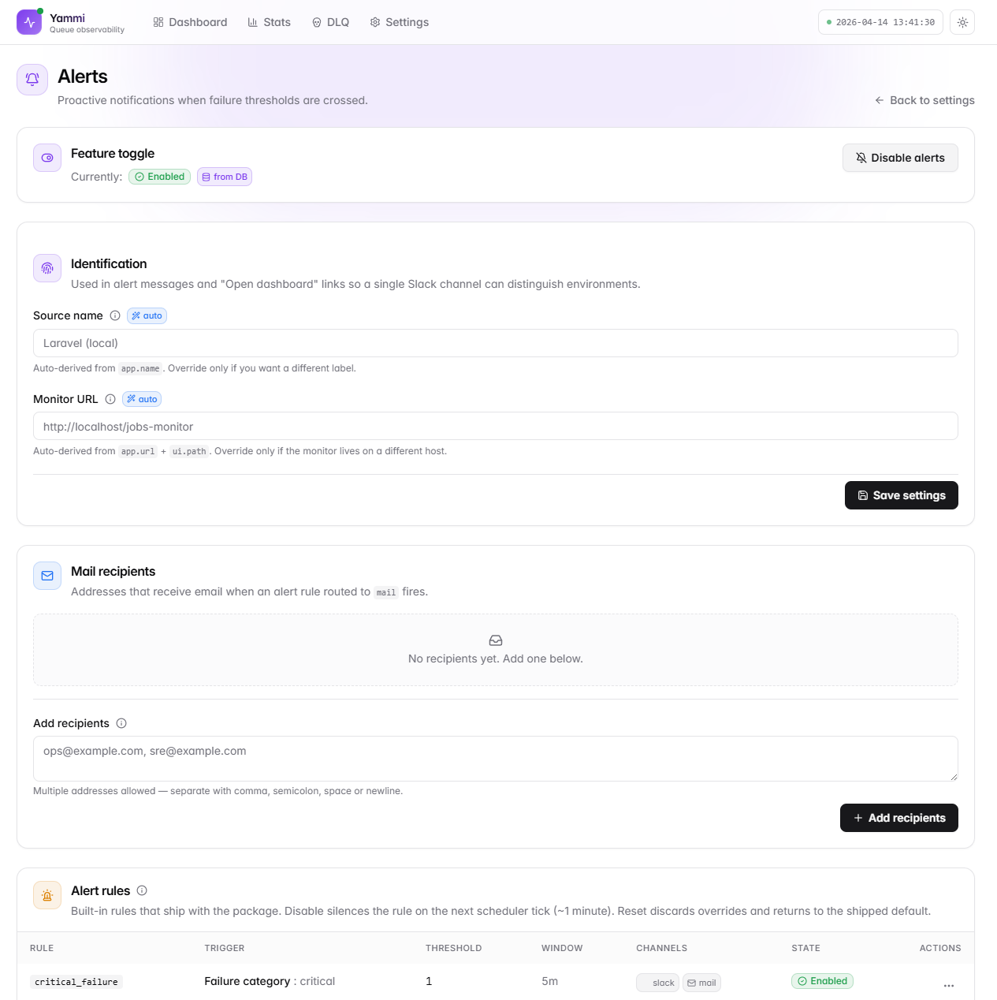

# yammi-jobs-monitoring-laravel

[](https://packagist.org/packages/romalytar/yammi-jobs-monitoring-laravel)
[](https://packagist.org/packages/romalytar/yammi-jobs-monitoring-laravel)
[](https://packagist.org/packages/romalytar/yammi-jobs-monitoring-laravel)
[](https://packagist.org/packages/romalytar/yammi-jobs-monitoring-laravel)

A lightweight production monitoring dashboard for Laravel queues
with retries, DLQ, failure classification, and Slack alerts.

Built for teams that need real visibility into their queues without
adding infrastructure or complexity.

It logs every job and shows:
- what executed
- what failed
- why it failed
- how long it took

Works with any queue driver.




## Core features

- **Live dashboard** — cards and chart auto-refresh
- **Retry system** — full attempt timeline per job
- **DLQ** — retry, edit-and-retry, delete
- **Failure tagging** — `transient` / `permanent` / `critical` / `unknown`
- **Alerts** — Slack + email on thresholds
- **Stats** — top failing, slowest, per-class breakdown
- **Settings UI** — edit alerts and rules without a redeploy
- **JSON API** — every screen has a matching endpoint

## Why this exists

You don't want:

- to be locked into a specific queue driver
- to rely on raw tables with no visibility
- to miss failures until users report them
- one broken job to burn through your worker capacity unnoticed

You want:

- to see every job execution in real time
- to understand failures instantly — not after digging through logs
- to react before issues escalate

That's what this panel is for.

## Design goals

- **No lock-in to a specific queue driver** — works with whatever
  you already have
- **No additional infrastructure required** — one table, one panel,
  done
- **Minimal setup, works out of the box** — sensible defaults,
  config is optional
- **Focused on queues** — not a full debugging suite, not an APM

## Install

```bash
composer require romalytar/yammi-jobs-monitoring-laravel
php artisan migrate
```

Install, open `/jobs-monitor`, and you immediately see what's
happening. Config is optional — defaults are sensible.

## Requirements

- PHP `^8.1`
- Laravel `^9.0 || ^10.0 || ^11.0 || ^12.0 || ^13.0`
- Any database supported by Laravel

## What's in it

### Dashboard with live chart and cards

Summary cards (total / processing / processed / failed / retry rate)
and the time-series chart on the dashboard refresh themselves on an
interval — no page reload needed. New jobs land on the chart as they
happen; failure spikes show up in seconds.

Period pills, search by job class, filters for status / queue /
connection / failure category. Active filters become chips you can
remove one at a time.


### Dark and light theme

One-click toggle in the top bar. Preference is persisted, so the
panel stays in whichever mode you picked.

| Dark                                       | Light                                       |
|--------------------------------------------|---------------------------------------------|
|     |     |

### Enhanced filters

Four dropdowns on the dashboard — **Status**, **Queue**, **Connection**,
**Failure category** — combine with the period pills and search box.
Queue and connection options are populated from the data that's
actually in the table, so you don't have to guess names. Active
filters show up as chips above the table; **Clear all** resets
everything in one click.



### Retry timeline

Click any job to see its full history. If it was retried, you see
every attempt — status, failure tag, duration, exception — and you
can jump between attempts with one click.



### Stats

One page to answer "how are my jobs doing": total, failure rate, retry
rate, most failing, slowest, plus a per-class breakdown.



### Dead letter queue (DLQ — failed jobs storage)

Jobs that ran out of retries or hit a permanent/critical failure land
here. This is the triage queue: everything on it actually needs a
human. Each row has a menu:

- **Retry** — re-dispatches with a fresh UUID so the new run shows
  up cleanly
- **Edit & retry** — opens a JSON editor; fix the data, submit, back
  on the queue
- **Delete** — removes every stored attempt for that UUID





### Failure tagging

When a job fails we look at the exception and tag it:

| Category    | Meaning                                  | Examples                                      |
|-------------|------------------------------------------|-----------------------------------------------|
| `transient` | Retry likely helps                       | timeout, deadlock, connection refused, 429    |
| `permanent` | Retry won't help, data/code is wrong     | validation, type error, invalid argument      |
| `critical`  | Code is broken, human attention needed   | class not found, undefined method, parse error |
| `unknown`   | No pattern matched                       | anything else                                  |

Swap in your own classifier:

```php
// config/jobs-monitor.php
'failure_classifier' => \App\Monitoring\MyClassifier::class,
```

Any class implementing
`Yammi\JobsMonitor\Domain\Job\Contract\FailureClassifier` works.

### Proactive alerts

Triggers on failure rate, a specific failure category, a specific job
class, or DLQ size. Four curated rules ship out of the box (two enabled
by default). Delivers to Slack (Block Kit with deep links) and email.
Threshold aggregation + per-rule cooldown + scheduled evaluation stop
it from spamming — typical = one message per incident.

Minimum setup:

```dotenv
JOBS_MONITOR_ALERTS_ENABLED=true
JOBS_MONITOR_SLACK_WEBHOOK=https://hooks.slack.com/services/...
JOBS_MONITOR_ALERT_MAIL_TO=ops@acme.com,oncall@acme.com
```

### Settings UI

Flip alerts on, edit source name / monitor URL / mail recipients, CRUD
your own alert rules and toggle built-in ones — no redeploy needed.
Resolution order: **DB row > config value > feature off**. Outbound
secrets (Slack webhook, signing secret) stay in config forever.



### Retention

Keeps the DB small in production — without retention a busy queue
pushes millions of rows a month. One command, plug it into your
scheduler and forget:

```bash
php artisan jobs-monitor:prune --days=30
```

```php
$schedule->command('jobs-monitor:prune')->daily();
```

## Configuration

```php
// config/jobs-monitor.php
return [
    'enabled' => env('JOBS_MONITOR_ENABLED', true),

    // Store raw job payload. Sensitive keys (password, token, secret,
    // api_key, authorization, credit_card, cvv, ssn) are automatically
    // replaced with ********. Required for DLQ retry to work.
    'store_payload' => env('JOBS_MONITOR_STORE_PAYLOAD', false),

    'failure_classifier' => null,          // FQCN or null for default

    'retention_days' => env('JOBS_MONITOR_RETENTION_DAYS', 30),

    'max_tries' => env('JOBS_MONITOR_MAX_TRIES', 3),

    'dlq' => [
        // Gate ability to consult before retry/delete.
        // Null = no check (fine for single-user setups, not for prod).
        'authorization' => env('JOBS_MONITOR_DLQ_GATE'),
    ],

    'ui' => [
        'enabled'    => env('JOBS_MONITOR_UI_ENABLED', true),
        'path'       => env('JOBS_MONITOR_UI_PATH', 'jobs-monitor'),
        'middleware' => ['web'],
    ],

    'api' => [
        'enabled'    => env('JOBS_MONITOR_API_ENABLED', false),
        'path'       => env('JOBS_MONITOR_API_PATH', 'api/jobs-monitor'),
        'middleware' => ['api'],
    ],

    'alerts' => [
        'enabled' => env('JOBS_MONITOR_ALERTS_ENABLED', false),
        // See full schema in docs — trigger / threshold / window / cooldown
    ],
];
```

### Protecting the dashboard

```php
'ui' => [
    'middleware' => ['web', 'auth', 'can:viewJobsMonitor'],
],
```

### Authorizing destructive DLQ actions

```php
// AppServiceProvider or AuthServiceProvider
Gate::define('manage-jobs-monitor', function ($user, string $action) {
    // $action is 'retry' or 'delete'
    return $user->hasRole('admin');
});
```

```dotenv
JOBS_MONITOR_DLQ_GATE=manage-jobs-monitor
```

### Publishing views / config / migrations

```bash
php artisan vendor:publish --tag=jobs-monitor-config
php artisan vendor:publish --tag=jobs-monitor-views
php artisan vendor:publish --tag=jobs-monitor-migrations
```

## JSON API

Everything in the UI is also available as JSON. Turn it on in config:

```php
'api' => ['enabled' => true, 'middleware' => ['api', 'auth:sanctum']],
```

### Jobs & failures

| Endpoint                                                | Purpose                                       |
|---------------------------------------------------------|-----------------------------------------------|
| `GET  /api/jobs-monitor/jobs`                           | Paginated jobs with filters & sorting         |
| `GET  /api/jobs-monitor/jobs/{uuid}/attempts`           | Every attempt for a UUID                      |
| `GET  /api/jobs-monitor/failures`                       | Failed jobs only (same filters as `/jobs`)    |

### Stats

| Endpoint                                                | Purpose                                       |
|---------------------------------------------------------|-----------------------------------------------|
| `GET  /api/jobs-monitor/stats?job_class=...`            | Stats for one class                           |
| `GET  /api/jobs-monitor/stats/overview`                 | Per-class stats across all classes            |
| `GET  /api/jobs-monitor/stats/summary`                  | Live counters (powers dashboard cards)        |
| `GET  /api/jobs-monitor/stats/time-series`              | Bucketed series (powers dashboard chart)      |

### DLQ

| Endpoint                                                | Purpose                                       |
|---------------------------------------------------------|-----------------------------------------------|
| `GET  /api/jobs-monitor/dlq`                            | Dead-letter entries                           |
| `POST /api/jobs-monitor/dlq/{uuid}/retry`               | Re-dispatch (optionally with edited payload)  |
| `POST /api/jobs-monitor/dlq/{uuid}/delete`              | Remove every stored attempt                   |

### Settings

| Endpoint                                                | Purpose                                       |
|---------------------------------------------------------|-----------------------------------------------|
| `GET    /api/jobs-monitor/settings`                     | All settings in one payload                   |
| `GET    /api/jobs-monitor/settings/alerts`              | Alert settings (toggle, source, monitor url, recipients) |
| `POST   /api/jobs-monitor/settings/alerts/toggle`       | Enable / disable alerts                       |
| `PUT    /api/jobs-monitor/settings/alerts`              | Update scalar alert settings                  |
| `POST   /api/jobs-monitor/settings/alerts/recipients`   | Add email recipient(s)                        |
| `DELETE /api/jobs-monitor/settings/alerts/recipients/{email}` | Remove a recipient                      |
| `GET    /api/jobs-monitor/settings/alerts/rules`        | List user-managed rules                       |
| `POST   /api/jobs-monitor/settings/alerts/rules`        | Create a new rule                             |
| `GET    /api/jobs-monitor/settings/alerts/rules/{id}`   | Show a single rule                            |
| `PUT    /api/jobs-monitor/settings/alerts/rules/{id}`   | Update a rule                                 |
| `DELETE /api/jobs-monitor/settings/alerts/rules/{id}`   | Delete a rule                                 |
| `POST   /api/jobs-monitor/settings/alerts/rules/built-in/{key}/toggle` | Enable / disable a built-in rule |

### Filters

On `/jobs` and `/failures`:

| Query param        | Values                                                   |
|--------------------|----------------------------------------------------------|
| `period`           | `1m` `5m` `30m` `1h` `6h` `24h` `7d` `30d` `all`         |
| `search`           | Substring on `job_class` (case-insensitive)              |
| `status`           | `processing` `processed` `failed`                        |
| `queue`            | Exact match                                              |
| `connection`       | Exact match                                              |
| `failure_category` | `transient` `permanent` `critical` `unknown`             |
| `sort`             | `started_at` `status` `duration_ms` `job_class`          |
| `dir`              | `asc` `desc`                                             |
| `page`, `per_page` | 1-based page, up to 200 per page                         |

Each record in the response:

```json
{
  "uuid": "550e8400-...",
  "attempt": 1,
  "job_class": "App\\Jobs\\SendInvoice",
  "connection": "redis",
  "queue": "default",
  "status": "failed",
  "started_at": "2026-04-12T12:00:00+00:00",
  "finished_at": "2026-04-12T12:00:02+00:00",
  "duration_ms": 2000,
  "exception": "RuntimeException: connection refused",
  "failure_category": "transient",
  "payload": { "..." }
}
```

There's a ready-to-use Postman collection under `postman/` with
example requests for every filter, sort column, retry, edit-and-retry,
delete and settings endpoint.

## Security-first design

A monitoring panel has access to your failure trail — that trail can
leak PII, tokens or whole auth headers if you're not careful. This
package is built so the secure option is the default:

- **No payload stored by default.** Set `store_payload=true` explicitly
  when you want DLQ retry to work.
- **Automatic sensitive-key masking.** When payload storage is on,
  `password`, `token`, `secret`, `api_key`, `authorization`,
  `credit_card`, `cvv`, `ssn` get replaced with `********` recursively
  at any depth. Bring your own redactor to add more keys.
- **Explicit authorization gate for DLQ actions.** Retry and delete
  consult a Laravel Gate (`JOBS_MONITOR_DLQ_GATE`) before running —
  no gate defined, no destructive action in prod.
- **UI behind middleware.** The panel mounts under your `web` middleware
  stack; bolt `auth` or a Gate on top and nobody anonymous sees it.
- **Fail-closed by design.** If the monitor itself fails for any reason,
  your job still runs. The monitor's job is to watch, not to get in
  the way.

## Facade

- Prometheus exporter (`/metrics` endpoint for scraping)
- Grafana integration (pre-built dashboard JSON)
- Multi-tenant support (scope data by a tenant key)
- Queue lag detection (backlog + worker-idle heatmap)
- Bulk DLQ operations (retry / delete selected)

## Facade

```php
use Yammi\JobsMonitor\Infrastructure\Facade\JobsMonitor;

JobsMonitor::recentJobs(50);
JobsMonitor::recentFailures(24);
JobsMonitor::stats(App\Jobs\SendInvoice::class);
JobsMonitor::queueSize('default');
```

## License

MIT
